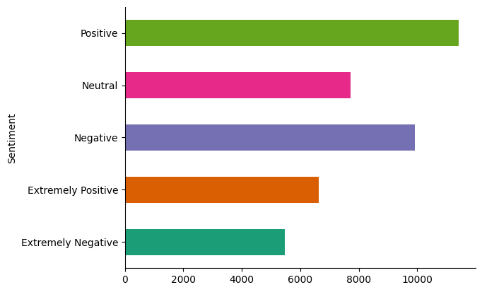

# Corona Tweet Sentiment Classification

## Table of Contents
- [Introduction](#introduction)
- [Dataset](#dataset)
- [Preprocessing Steps](#preprocessing-steps)
- [Models and Techniques](#models-and-techniques)
- [Evaluation](#evaluation)
- [Results](#results)
- [Conclusion](#conclusion)

    

  

## Introduction
The Corona Tweet Sentiment Classification project aims to classify tweets related to COVID-19 into five sentiment categories:
- 0: Neutral
- 1: Positive
- 2: Extremely Positive
- -2: Extremely Negative
- -1: Negative
  
## Dataset
The dataset contains tweets related to COVID-19 along with their corresponding sentiment labels. The tweets have been cleaned and preprocessed to remove unwanted characters, URLs, punctuation, and stop words. The dataset is split into training and testing sets for model evaluation. [COVID-19 NLP Text Classification Dataset](https://www.kaggle.com/datasets/datatattle/covid-19-nlp-text-classification/data)

  

    

    

  

## Preprocessing Steps
1. **Text Cleaning:** Removing URLs, punctuations, and other unwanted characters.
2. **Lowercasing:** Converting all text to lowercase.
3. **Tokenization:** Splitting text into tokens (words).
4. **Removing Stop Words:** Eliminating common words that do not add significant meaning.
5. **Stemming/Lemmatization:** Reducing words to their root form.
6. **Vectorization**

## Models and Techniques
### Vectorization Techniques
- **TF-IDF (Term Frequency-Inverse Document Frequency):** Converts text data into numerical representation by considering the frequency of words and their importance in the document.
- **Word2Vec:** A neural network-based embedding technique that represents words in continuous vector space.

### Classifiers
- **Logistic Regression:** A linear model for binary and multiclass classification tasks.
- **Naive Bayes:** A probabilistic classifier based on Bayes' theorem with strong independence assumptions.
- **Support Vector Machines (SVM):** A classifier that finds the hyperplane that best separates different classes.
- **Random Forest:** An ensemble learning method that constructs multiple decision trees.
- **Ensemble Voting Classifier:** Combines predictions from multiple models to improve performance.

## Evaluation
The models are evaluated using accuracy, precision, recall, F1 score, and confusion matrix.

## Results
The performance of the models using different feature extraction techniques is summarized below:

| Model                      | Vectorization | Accuracy | Precision | Recall  | F1 Score |
|----------------------------|---------------|----------|-----------|---------|----------|
| Logistic Regression        | TF-IDF        | 0.5743   | 0.5472    | 0.5391  | 0.5403   |
| Naive Bayes                | TF-IDF        | 0.3746   | 0.6244    | 0.3661  | 0.2732   |
| SVM                        | TF-IDF        | 0.6229   | 0.6309    | 0.6229  | 0.6241   |
| Random Forest              | TF-IDF        | 0.5279   | 0.5509    | 0.5279  | 0.5204   |
| Voting Classifier          | TF-IDF        | 0.6259   | 0.6347    | 0.6259  | 0.6258   |
| Logistic Regression        | N-Grams       | 0.5391   | 0.5472    | 0.5391  | 0.5403   |
| Naive Bayes                | N-Grams       | 0.3661   | 0.6244    | 0.3661  | 0.2732   |
| Voting Classifier          | N-Grams       | 0.5328   | 0.5472    | 0.5391  | 0.5403   |
| Logistic Regression        | Word2Vec      | 0.5328   | 0.5472    | 0.5391  | 0.5403   |
| Naive Bayes                | Word2Vec      | 0.3661   | 0.6244    | 0.3661  | 0.2732   |
| Voting Classifier          | Word2Vec      | 0.5328   | 0.5472    | 0.5391  | 0.5403   |

### Evaluation Metrics for Best Performing Models (TF-IDF):
#### SVM:
- Accuracy: 0.6229
- Precision: Varies across classes
- Recall: Varies across classes
- F1 Score: Varies across classes

#### Ensemble Voting Classifier:
- Accuracy: 0.6259 
- Precision: Varies across classes
- Recall: Varies across classes
- F1 Score: Varies across classes

## Conclusion
The Voting Classifier with TF-IDF vectorization achieved the highest accuracy (0.6259) and F1 Score (0.6258) among the models tested. The SVM with TF-IDF also showed strong performance with an accuracy of 0.6229 and F1 Score of 0.6241. The Random Forest classifier with TF-IDF performed less effectively compared to the other models, with an accuracy of 0.5279 and F1 Score of 0.5204. Combining multiple models in the Voting Classifier proved to be beneficial for improving classification performance.

